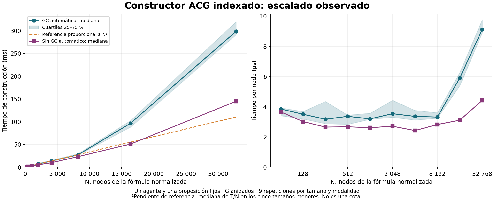

# Escalado medido del constructor indexado

Fecha: 2026-09-15. Constructor en commit `7769610ceae2a165f54dc6cf10f3e72de900586e`.



## Protocolo

Fórmulas ya normalizadas: n operadores estratégicos G anidados sobre p. Un agente y una proposición fijos. Tamaño N=2n+1, contado en nodos AST, incluidos los envoltorios temporales. Diez tamaños, de 65 a 32769 nodos, nueve repeticiones por tamaño y modalidad: 180 medidas publicadas. El orden de tamaños y repeticiones se baraja con semilla fija dentro de cada modalidad. Las modalidades se ejecutan sucesivamente, no intercaladas.

El cronómetro cubre únicamente build_acg_indexed: desde un AST disponible hasta la devolución del ACG simbólico completo. Incluye su validación. No incluye generación, normalización, renderizado, construcción del CGS/juego, solver ni destrucción del resultado. Se realiza gc.collect antes de cada intervalo. Una serie conserva el GC automático y la otra lo desactiva temporalmente durante la construcción; ambas conservan la gestión de referencias de Python. Este control sirve para diagnosticar sensibilidad al runtime, no para seleccionar solo la curva más favorable.

## Datos

Valores en milisegundos; medianas de nueve repeticiones. Datos brutos y metadatos en indexed_scaling.json e indexed_scaling_gc_disabled.json.

| Nodos AST | GC automático, ms | Sin GC automático, ms |
|---:|---:|---:|
| 65 | 0.250 | 0.238 |
| 129 | 0.452 | 0.390 |
| 257 | 0.816 | 0.683 |
| 513 | 1.728 | 1.373 |
| 1025 | 3.278 | 2.684 |
| 2049 | 7.263 | 5.561 |
| 4097 | 13.780 | 9.946 |
| 8193 | 27.206 | 23.163 |
| 16385 | 96.798 | 51.026 |
| 32769 | 298.603 | 144.967 |

## Lectura del resultado

Con GC automático, el tiempo por nodo se mantiene aproximadamente entre 3 y 4 microsegundos hasta 8193 nodos; crece hasta unos 9.1 microsegundos en el máximo. Desactivar GC reduce la desviación, pero no la elimina: en 32769 nodos sigue siendo aproximadamente 4.4 microsegundos por nodo. No se ha aislado la causa del aumento residual; asignación, memoria y variación del entorno requieren un perfil específico antes de atribuirlo. Las mediciones no están en una máquina dedicada ni prueban una clase asintótica.

La línea discontinua usa la mediana de T/N de los cinco tamaños menores como pendiente ilustrativa. No es un ajuste global, una predicción certificada ni una cota superior. La banda representa los cuartiles 25–75 %, no un intervalo de confianza. No se ocultan los puntos grandes ni se afirma que la gráfica sea perfectamente lineal.

## Qué se sostiene matemáticamente

El argumento de linealidad procede del algoritmo: visita cada ocurrencia una vez, crea como máximo dos estados por ocurrencia de fórmula de estado y emite un número acotado de nodos de transición por registro. En esta familia el contador observado es exactamente N visitas, N+1 estados y N-1 esquemas almacenados. Ese contador es una comprobación estructural, no un contador completo de instrucciones de máquina.

Con agentes fijos y operaciones amortizadas de coste constante sobre referencias y contenedores, este diseño tiene coste lineal en el tamaño AST. No es una demostración del tiempo de CPython, que incluye recolector, asignaciones y efectos del entorno. La cota y su modelo deben distinguirse de un tiempo experimental exactamente proporcional. Esta familia tampoco sustituye un análisis de las demás formas sintácticas.

## Reproducción

```bash
PYTHONHASHSEED=0 python3 -m scripts.plot_indexed_scaling
```

Requiere matplotlib para las figuras. Escribe JSON, PNG y SVG en docs. El código de producción no cambia; no se modifica LaTeX ni se sustituye la evaluación histórica.
